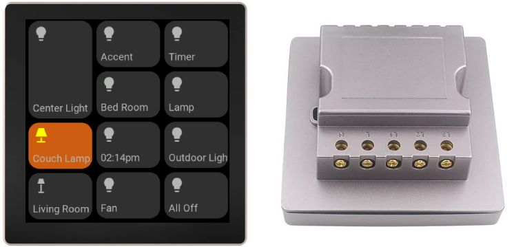

## Product specs

Screen: st7701s driver 480\*480
Touch screen: gt911
CPU: ESP32-S3
Flash: 16MB
PSRAM: 8MB

## Product description

Nice little integrated screen, touch screen, power supply and case with built in relay and 120v/220v power supply.

Avalible on [AliExpress](https://www.aliexpress.com/item/3256806115962222.html) for ~$24.

## Basic Config

```yaml
substitutions:
  name: "guition-esp32-s3-4848s040"
  friendly_name: "Guition480-basic"
  device_description: "Guition ESP32-S3-4848S040 480*480 Smart Screen"
  project_name: "Guition.ESP32_S3_4848S040"
  project_version: "1.0.0"

  lightbulb: "\U000F0335"
  ceiling_light: "\U000F0769"
  lamp: "\U000F06B5"
  floor_lamp: "\U000F08DD"
  string_lights: "\U000F12BA"

esphome:
  name: "${name}"
  friendly_name: "${friendly_name}"
  #name_add_mac_suffix: true
  project:
    name: "${project_name}"
    version: "${project_version}"
  platformio_options:
    board_build.flash_mode: dio

esp32:
  board: esp32-s3-devkitc-1
  variant: esp32s3
  flash_size: 16MB
  framework:
    type: esp-idf
    sdkconfig_options:
      COMPILER_OPTIMIZATION_SIZE: y
      CONFIG_ESP32S3_DEFAULT_CPU_FREQ_240: "y"
      CONFIG_ESP32S3_DATA_CACHE_64KB: "y"
      CONFIG_ESP32S3_DATA_CACHE_LINE_64B: "y"
      CONFIG_SPIRAM_FETCH_INSTRUCTIONS: y
      CONFIG_SPIRAM_RODATA: y

psram:
  mode: octal
  speed: 80MHz

logger:

api:
  encryption:
    key: !secret encryption_key

ota:
  password: !secret ota_password

wifi:
  ssid: !secret wifi_ssid
  password: !secret wifi_password

web_server:
  port: 80

external_components:
  - source:
      type: git
      url: https://github.com/clydebarrow/esphome
      ref: 82264dc2440981873b8400d613e0cc32d229daa3 #previous commit - wont be needed in the future
    components: [lvgl]

sensor:
  - platform: wifi_signal
    name: "WiFi Signal"
    id: wifi_signal_db
    update_interval: 60s
    entity_category: diagnostic
    internal: true

  # Reports the WiFi signal strength in %
  - platform: copy
    source_id: wifi_signal_db
    name: "WiFi Strength"
    filters:
      - lambda: return min(max(2 * (x + 100.0), 0.0), 100.0);
    unit_of_measurement: "%"
    entity_category: diagnostic

text_sensor:
  - platform: wifi_info
    ip_address:
      name: "IP Address"
      entity_category: diagnostic
    ssid:
      name: "Connected SSID"
      entity_category: diagnostic
    mac_address:
      name: "Mac Address"
      entity_category: diagnostic

#-------------------------------------------
# LVGL Buttons
#-------------------------------------------
lvgl:
  displays:
    - display_id: my_display
  touchscreens:
    - touchscreen_id: my_touchscreen
  on_idle:
    - timeout: 10s
      then:
        - logger.log: idle timeout
        - if:
            condition:
              lvgl.is_idle:
                timeout: 5s
            then:
              - logger.log: LVGL is idle
    - timeout: 15s
      then:
        - logger.log: idle 15s timeout

      #- lvgl.pause:
      #- light.turn_off:
      #    id: display_backlight
      #    transition_length: 5s

  style_definitions:
    - id: style_line
      line_color: 0x0000FF
      line_width: 8
      line_rounded: true
    - id: date_style
      text_font: roboto24
      align: center
      text_color: 0x333333
      bg_opa: cover
      radius: 4
      pad_all: 2

  theme:
    btn:
      text_font: roboto24
      scroll_on_focus: true
      group: general
      radius: 25
      width: 150
      height: 109
      pad_left: 10px
      pad_top: 10px
      pad_bottom: 10px
      pad_right: 10px
      shadow_width: 0
      bg_color: 0x313131
      text_color: 0xB6B6B6
      checked:
        bg_color: 0xCC5E14
        text_color: 0xB6B6B6

  page_wrap: true
  pages:
    - id: main_page
      skip: true
      layout:
        type: flex
        flex_flow: column_wrap
      width: 100%
      bg_color: 0x000000
      bg_opa: cover
      pad_all: 5
      widgets:
        - btn:
            height: 223
            checkable: true
            id: lv_button_1
            widgets:
              - label:
                  text_font: light40
                  align: top_left
                  text: $lightbulb
                  id: lv_button_1_icon
              - label:
                  align: bottom_left
                  text: "Center Light"
                  long_mode: dot
            on_click:
              light.toggle: internal_light

#-------------------------------------------
# Internal outputs
#-------------------------------------------
output:
  # Backlight LED
  - platform: ledc
    pin: GPIO38
    id: GPIO38
    frequency: 100Hz

    # Built in 240v relay
  - id: internal_relay_1
    platform: gpio
    pin: 40

#-------------------------------------------
# Internal lights
#-------------------------------------------
light:
  - platform: monochromatic
    output: GPIO38
    name: Backlight
    id: backlight
    restore_mode: ALWAYS_ON

  - platform: binary
    output: internal_relay_1
    name: Internal Light
    id: internal_light
    on_turn_on:
      then:
        - lvgl.widget.update:
            id: lv_button_1_icon
            text_color: 0xFFFF00
        - lvgl.widget.update:
            id: lv_button_1
            state:
              checked: true
    on_turn_off:
      then:
        - lvgl.widget.update:
            id: lv_button_1_icon
            text_color: 0xB6B6B6
        - lvgl.widget.update:
            id: lv_button_1
            state:
              checked: false

#-------------------------------------------
# Graphics and Fonts
#-------------------------------------------
font:
  - file: "gfonts://Roboto"
    id: roboto24
    size: 24
    bpp: 4
    extras:
      - file: "fonts/materialdesignicons-webfont.ttf" # http://materialdesignicons.com/cdn/7.4.47/
        glyphs:
          [
            "\U000F004B",
            "\U0000f0ed",
            "\U000F006E",
            "\U000F012C",
            "\U000F179B",
            "\U000F0748",
            "\U000F1A1B",
            "\U000F02DC",
            "\U000F0A02",
            "\U000F035F",
            "\U000F0156",
            "\U000F0C5F",
            "\U000f0084",
            "\U000f0091",
          ]

  - file: "fonts/materialdesignicons-webfont.ttf" # http://materialdesignicons.com/cdn/7.4.47/
    id: light40
    size: 40
    bpp: 4
    glyphs: [
        "\U000F0335", # mdi-lightbulb
        "\U000F0769", # mdi-ceiling-light
        "\U000F06B5", # mdi-lamp
        "\U000F08DD", # mdi-floor-lamp
        "\U000F12BA", # mdi-string-lights
      ]

#-------------------------------------------
# Touchscreen gt911 i2c
#-------------------------------------------
i2c:
  - id: bus_a
    sda: GPIO19
    scl: GPIO45
    #frequency: 100kHz

touchscreen:
  platform: gt911
  transform:
    mirror_x: false
    mirror_y: false
  id: my_touchscreen
  display: my_display

  on_touch:
    - logger.log:
        format: Touch at (%d, %d)
        args: [touch.x, touch.y]
    - lambda: |-
        ESP_LOGI("cal", "x=%d, y=%d, x_raw=%d, y_raw=%0d",
            touch.x,
            touch.y,
            touch.x_raw,
            touch.y_raw
            );

#-------------------------------------------
# Display st7701s spi
#-------------------------------------------
spi:
  - id: lcd_spi
    clk_pin: GPIO48
    mosi_pin: GPIO47

display:
  - platform: st7701s
    id: my_display
    update_interval: never
    auto_clear_enabled: False
    spi_mode: MODE3
    data_rate: 2MHz
    color_order: RGB
    invert_colors: False
    dimensions:
      width: 480
      height: 480
    cs_pin: 39
    de_pin: 18
    hsync_pin: 16
    vsync_pin: 17
    pclk_pin: 21
    pclk_frequency: 12MHz
    pclk_inverted: False
    hsync_pulse_width: 8
    hsync_front_porch: 10
    hsync_back_porch: 20
    vsync_pulse_width: 8
    vsync_front_porch: 10
    vsync_back_porch: 10
    init_sequence:
      - 1
      # Custom sequences are an array, first byte is command, the rest are data.
      - [0xFF, 0x77, 0x01, 0x00, 0x00, 0x10] # CMD2_BKSEL_BK0
      - [0xCD, 0x00] # disable MDT flag
    data_pins:
      red:
        - 11 #r1
        - 12 #r2
        - 13 #r3
        - 14 #r4
        - 0 #r5
      green:
        - 8 #g0
        - 20 #g1
        - 3 #g2
        - 46 #g3
        - 9 #g4
        - 10 #g5
      blue:
        - 4 #b1
        - 5 #b2
        - 6 #b3
        - 7 #b4
        - 15 #b5
```
